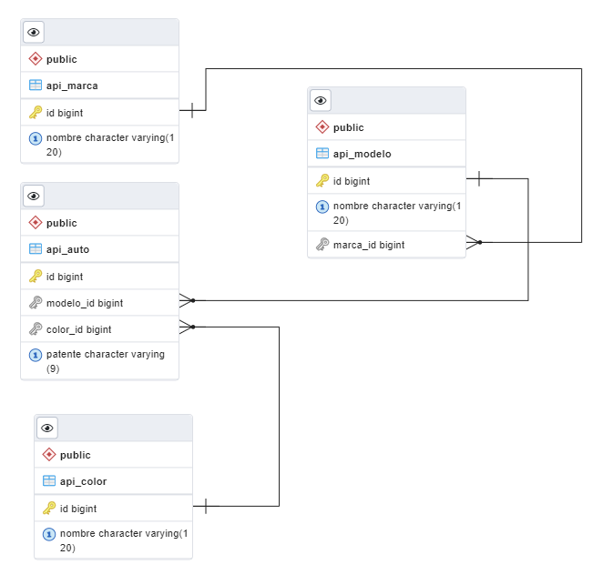

# Sistema de administración de autos

## Tecnologías utilizadas:

- Django con DRF para crear la RESTful API
- Postgres para la base de datos
- Angular para el front

## Demo

## Endpoints de la API

| **Path**         | **Método** | **Acción**     |
|------------------|------------|----------------|
| /api/autos       | GET        | Listar autos   |
| /api/autos       | POST       | Registrar auto |
| /api/autos/{pk}/ | GET        | Detalle auto   |
| /api/autos/{pk}/ | PUT        | Editar auto    |
| /api/autos/{pk}/ | PATCH      | Editar auto    |
| /api/autos/{pk}/ | DELETE     | Eliminar auto  |
| /api/modelos       | GET        | Listar modelos   |
| /api/modelos       | POST       | Registrar modelo |
| /api/modelos/{pk}/ | GET        | Detalle modelo   |
| /api/modelos/{pk}/ | PUT        | Editar modelo    |
| /api/modelos/{pk}/ | PATCH      | Editar modelo    |
| /api/modelos/{pk}/ | DELETE     | Eliminar modelo  |
| /api/marcas       | GET        | Listar marcas   |
| /api/marcas       | POST       | Registrar marca |
| /api/marcas/{pk}/ | GET        | Detalle marca   |
| /api/marcas/{pk}/ | PUT        | Editar marca    |
| /api/marcas/{pk}/ | PATCH      | Editar marca    |
| /api/marcas/{pk}/ | DELETE     | Eliminar marca  |
| /api/colores       | GET        | Listar colores   |
| /api/colores       | POST       | Registrar color |
| /api/colores/{pk}/ | GET        | Detalle color   |
| /api/colores/{pk}/ | PUT        | Editar color    |
| /api/colores/{pk}/ | PATCH      | Editar color    |
| /api/colores/{pk}/ | DELETE     | Eliminar color  |

## ERD

## Clientes
 - Aplicación angular con funcionalidad de CRUD para los cuatro modelos/tablas
 - Terminales interactivas en python (carpeta clients)

## Notas

- El back lo traté de hacer con el código más limpio posible, utilizando herencias y mixins que sirven tanto para validar las patentes como para guardar de forma uniforme los datos en la base de datos.
- Tambien utilicé viewsets y routers para seguir las buenas prácticas de REST y que los endpoints sean lo más uniformes posibles, sin incluír verbos en los urls.
- En cuanto al front, al tener que aprender angular de cero hice lo posible por tener un código ordenado pero creo que podría haber reutilizado muchos componentes para ahorrar repetir código, de todas formas seguiré tratando de refactorizar el código lo máximo posible.
- Para la búsqueda utilicé una API de terceros llamada ALGOLIA que indexa los modelos y la configuré para que permita buscar por dos parámetros, sfor (índice) y q (query).
- No llegué a implementar la búsqueda en el front.
- De algunas cosas de la API me di cuenta recién mientras la consumía desde el front, como que muchas veces era útil incluír los ids/pks además de las relaciones hyperlinkeadas.
- La decisión de utilizar varias tablas en lugar de una sola tabla auto con diferentes atributos se da debido a que de esa forma se iba a repetir demasiada información en la base de datos.

